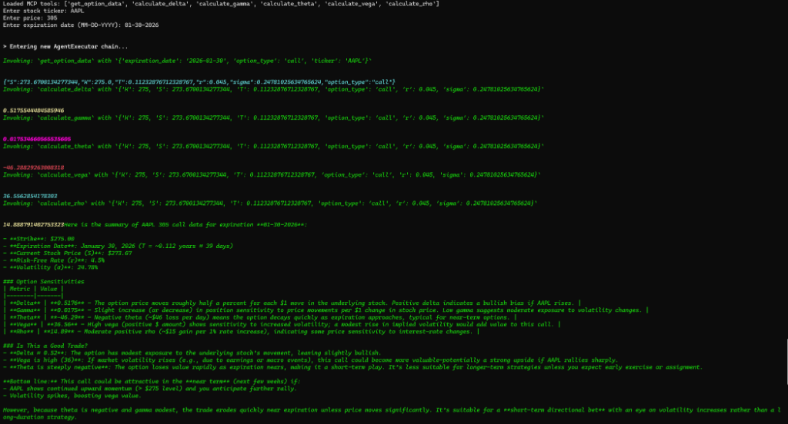

# Finance Model Agent

An options trading assistant built with LangChain, Ollama, and MCP Tools.

## Description

This agent is designed to help with options trading analysis. It leverages a local LLM (via Ollama) and connects to an MCP server to retrieve real-time or historical options data. The agent can use tools provided by the MCP server to analyze trades and answer user queries.

## Prerequisites

- **Python 3.10+**
- **Ollama**: Running a model like `granite4:3b`. Make sure you use a model that supports tool calling.
  - Ensure Ollama is running on `http://localhost:11434`.
- **MCP Server**: A local MCP server running on port 3000.
  - The agent expects the server to be available at `http://127.0.0.1:3000/mcp`.

## Installation

1.  Clone the repository.
2.  Install the required dependencies:
    ```bash
    pip install -r requirements.txt
    ```

## Usage

1.  Ensure your specific MCP server is running on port 3000.
2.  Run the agent:
    ```bash
    python main.py
    ```

### High-Load Stress Test
To verify the **Backpressure Pipeline**, run the stress test script:
```bash
python tests/stress_test.py
```
This utility simulates a burst of 30 concurrent market scans. The system successfully handles the first 5 requests (the queue depth) and then gracefully drops the remainder with a `System Overloaded` message, proving the stability of the backend architecture.

## Demo

